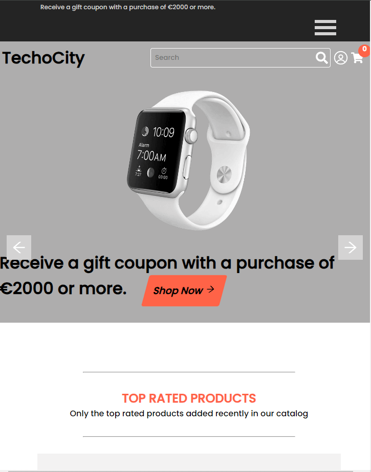

# TechnoCity

## E-Shop Project

Welcome to the E-Shop project!  
 This project is a front-end implementation of an e-commerce platform for selling mobiles, laptops, and home appliances.

## You can view the project online [here](https://techno-city-ecommerce.vercel.app/)

## Table of Contents

- [Features](#features)
- [Installation](#installation)
- [Usage](#usage)
- [Technologies Used](#technologies-used)

## Features

- Browse and view products in different categories.
- Add products to the cart.
- View and edit the shopping cart.
- Place an order.

## Installation

- Open the project folder using VS Code or any preferred code editor.
- Clone the repository:

```bash
  git clone https://github.com/MaryRichelle/TechnoCity.git

```

- Run `npm install` command to download all dependencies listed in package.json file.
- Create a `.env.local` file in the root folder of the project

```env
apiKey = process.env.REACT_APP_API_KEY;
```

- Start the server by running `npm start` from the terminal.
- The application will be accessible at <http://localhost:3000/>.

## Usage

- Navigate through the categories to explore products.  
- Click on a product to view details.  
- Add products to the cart.  
- Go to the cart page to review and modify your order.  
- Proceed to checkout to place an order.  

## Technologies Used

- [create react app](https://github.com/facebook/create-react-app)
- React Router
- Styled Components
- axios
- Public Api for Products

***


